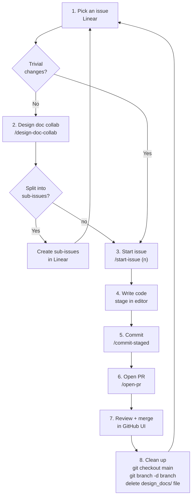
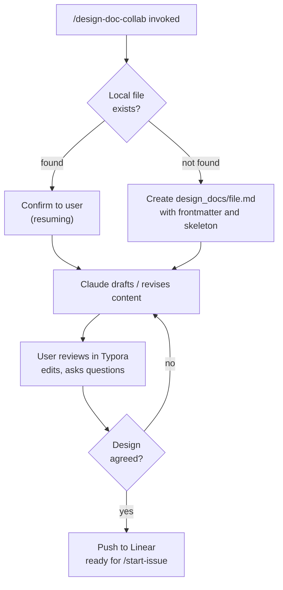

# claude-workflow-starter

A lightweight, portable [Claude Code](https://claude.ai/code) configuration that adds a structured git workflow to any project — issue tracking, branching, design docs, commits, and PRs. I moved from a "everything in my head" workflow to this slightly more organised structure. Many steps are intentionally left manual (diff reviews, staging, and post-merge cleanup). There are far more automated workflows out there, but this balance of manual control and automation is just my current personal preference.

### Prerequisites

- [Claude Code](https://claude.ai/code) CLI
- [GitHub CLI](https://cli.github.com/) (`gh`) authenticated
- Linear MCP server configured
- [Typora](https://typora.io/) for local design doc editing (opened automatically by `/design-doc-collab`)

## Installation

Run this from the root of your project:

```bash
gh api repos/thirdsunhq/dev-workflow/contents/install.sh --jq '.content' | base64 -d | bash
```

This downloads the `.claude/rules/` and `.claude/skills/` files into your project. Existing files in `.claude/` are not removed — only the listed files are written.

### Customise

Update the team name in the skill files to match your Linear workspace:

| File | Value to change | What it controls |
|---|---|---|
| `.claude/skills/new-issue/SKILL.md` | `"thirdsun"` | Linear team name for issue creation |

## The Workflow

- Always start from and return to a clean `main`
- One issue → one branch → one PR
- Design doc lives locally in `design_docs/` during development; pushed to Linear when finalised — no branch needed during design
- Branch creation is the moment you commit to a scope of work
- I still like to manually review and stage changes before commit (helps internalise project state)
- Commits are always manual via `/commit-staged` — the skill never auto-commits



## Skills

| Command | What it does |
|---|---|
| `/new-issue` | Create and label a Linear issue |
| `/start-issue <id>` | Pull main, check out the branch derived from the Linear issue (e.g. `THI-11`) |
| `/design-doc-collab` | Start or resume a collaborative design doc session in Linear, attached to the current issue |
| `/commit-staged` | Commit staged changes with a conventional message, inferring type and Linear issue ID from the branch |
| `/open-pr` | Fetch latest and open a PR from current branch into main, referencing the Linear issue |

## Design Doc Collaboration

`/design-doc-collab` expands step 2 into a live, iterative loop between Claude and the user — active whenever you're working on a design, not a strict mode that must be exited.



`/design-doc-collab` opens the local file in Typora automatically — a WYSIWYG markdown editor so you see the rendered doc, not raw markdown, while Claude revises alongside you in the conversation.

### Naming conventions

- **Local:** `design_docs/<branch-slug>.md` — `gitBranchName` with `username/` prefix stripped (e.g. `design_docs/thi-11-define-and-validate-development-workflow.md`); gitignored
- **Linear:** document titled `<IDENTIFIER>: <issue title>`, attached to the issue — permanent record
- Local file carries frontmatter: `linear_doc_id`, `issue`, `created_at`, `created_by`

### Sync triggers

| Trigger | Action |
|---|---|
| "push to linear" / "sync to linear" | Upload local content to Linear document (create or update) |
| "pull from linear" / "check linear" | Fetch Linear doc, show diff, update local file |
| Design agreed | Push final content, confirm attached to issue |
| Branch cleanup (post-merge) | Delete local `design_docs/` file — Linear doc persists |
