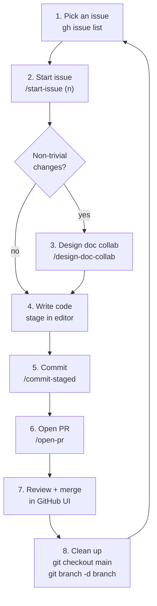
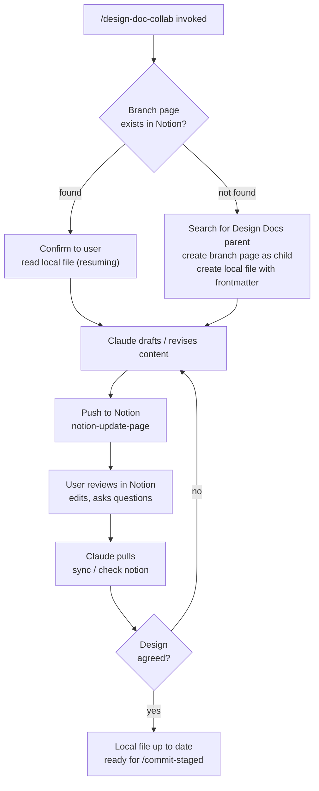

# claude-workflow-starter

A lightweight, portable [Claude Code](https://claude.ai/code) configuration that adds a structured git workflow to any project — issue tracking, branching, design docs, commits, and PRs. I moved from a "everything in my head" workflow to this slightly more organised structure. Many steps are intentionally left manual (diff reviews, staging, and post-merge cleanup). There are far more automated workflows out there, but this balance of manual control and automation is just my current personal preference.

### Prerequisites

- [Claude Code](https://claude.ai/code) CLI
- [GitHub CLI](https://cli.github.com/) (`gh`) authenticated
- Notion MCP server configured (only required for `/design-doc-collab`)

## The Workflow

- Always start from and return to a clean `main`
- One issue → one branch → one PR. 
- Design doc work slots in as an optional step between branch creation and coding.
- I still like to manually review and stage changes before commit (helps internalise project state)
- Commits are always manual via `/commit-staged` — the skill never auto-commits




## Skills

| Command | What it does |
|---|---|
| `/new-issue` | Create and label a GitHub issue |
| `/start-issue <n>` | Pull main, derive branch name from issue label/title, check it out |
| `/design-doc-collab` | Start or resume a collaborative design doc session (Notion + local) |
| `/commit-staged` | Commit staged changes with a conventional message, inferring type and issue number from the branch |
| `/open-pr` | Fetch latest and open a PR from current branch into main |

## Design Doc Collaboration

`/design-doc-collab` expands step 3 into a live, iterative loop between Claude and the user — active whenever you're working on a design, not a strict mode that must be exited.



### Naming conventions

- **Notion:** Design Docs > `<Label>: <issue title> (#<n>)`
- **Local:** `<your-designs-dir>/<branch-slug>.md` — gitignored, not tracked
- Local file carries frontmatter: `notion_page_id` and `notion_url`

### Sync triggers

| Trigger | Action |
|---|---|
| "check notion" / "pull from notion" / "sync" | Fetch page, diff vs local, update local |
| After any draft or revision | Push to Notion via `replace_content` |
| Session start (resuming) | Read local frontmatter, confirm existing page |

## Installation

Copy the `.claude/` directory into your project root:

```bash
cp -r .claude/ /path/to/your-project/
```

### Customise

Two values in the `design-doc-collab` files are set to conventions from the source project — update them to match your own:

| File | Value to change | What it controls |
|---|---|---|
| `.claude/rules/common/design-doc-collab.md` | `project_docs/designs/` | Local directory for design doc files |
| `.claude/skills/design-doc-collab/SKILL.md` | `project_docs/designs/` | Same path, referenced in the skill |
| `.claude/skills/design-doc-collab/SKILL.md` | `"Design Docs"` | Notion parent page name |
